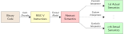

# A Versatile and Flexible RISC-V Model

This is an extensible [RISC-V][riscv web] implementation which provides an executable, formal model of the architecture.
The formal model is implemented using [free monads][free monads] and a custom expression language for arithmetic operations.
Based on this formal model, custom interpreters for RISC-V instructions can be easily implemented, e.g. to perform [symbolic execution][symbolic execution wikipedia] of binary code.
More information about LibRISCV is available in the publication [*Versatile and Flexible Modelling of the RISC-V Instruction Set Architecture*][agra preprint] which was published as part of the proceedings of the 2023 [*Trends in Functional Programming*][springer tfp2023] conference.

## Features

* Abstract description of RISC-V instructions based on free monads
* Custom expression language to perform operations on arbitrary types
    * Instruction operands must not be concrete fixed-width integers
    * Can also be SMT expressions for example (useful for symbolic execution)
* Polymorphic implementations of byte-addressable memory and register file
* RISC-V instruction decoder which is auto-generated from [riscv-opcodes][riscv-opcodes github]

## Installation

This software can be installed either using [Cabal][cabal web] or [Docker][docker web].
The latter installation method may be preferable if you don't have a RISC-V cross compiler installed on your system.
Both methods are described further below under the assumption that the repository has been cloned already.

### Cabal

Assuming cabal has already been setup, run the following command within the source directory to install LibRISCV:

    $ cabal install

This should place the concrete example interpreter (`riscv-tiny`) in your `$PATH`.

### Docker

To ease installation of a RISC-V cross compiler toolchain a Dockerfile is provided.
To build and run a Docker container using this file invoke the following commands:

    $ docker build -t libriscv .
    $ docker run -it libriscv

This will drop you in an interactive shell within the Docker container.
See the section below for more information on which commands can be run within the container.
Within the container, the LibRISCV source code is available in the LibRISCV subdirectory.

## Overview

<p align="center">
	
</p>

LibRISCV is a library which enables the creation of custom interpreters/executors for RISC-V binary code.
To this end, it includes a decoder which is generated from the existing [riscv-opcodes][riscv-opcodes github] tooling.
Based on decoded opcodes, LibRISCV provides a formal model which *abstractly* describes the semantics of RISC-V instructions using a [Haskell-based EDSL][haskell edsl].
This description is embedded directly into LibRISCV and available in the `lib/LibRISCV/Semantics` subdirectory[^1].
As an example, the abstract description of the RISC-V LH (load half) instruction looks as follows:

```Haskell
instrSemantics LH = do
    (r1, rd, imm) <- decodeAndReadIType
    half <- load Half $ r1 `addImm` imm
    writeRegister rd $ sextImm 16 half
```

This description describes the abstract semantics in terms of several primitives (`load`, `addImm`, `sextImm`, …).
Based on these primitives, we can build custom interpreters which supply the *actual semantics* for these primitives.
The standard example in this regard would be a concrete interpreter which supplies a concrete implementation of the register file, memory, … to implement concrete semantics for these language primitives.
In fact, such a concrete interpreter is provided by the LibRISCV library (see below) and provides polymorphic implementations of the register file, etc. which can be reused for the creation of custom interpreters.
More information on the creation of custom interpreters is provided below.

[^1]: Presently, abstract semantics for custom instructions cannot be supplied without modifying LibRISCV.

## Building Interpreters

Information on building custom interpreters is provided through the Haddock Haskell documentation.
The entry point in this regard is the `LibRISCV.Semantics.buildAST` function.
This function returns an effect which must then be interpreted.
Conceptually, LibRISCV differentiates several modular effects (see the `LibRISCV.Effects` namespace for a list of available effects).
This facilitates reuse and composition of existing interpreters, for example, even a symbolic interpreter may reuse a concrete decoder.
Therefore, the LibRISCV library commonly provides a default, concrete interpreter for all effects.

Exemplary interpreters are available as follows:

1. The [concrete interpreter][riscv-tiny github] bundled with LibRISCV itself
2. A [symbolic interpreter][binsym github] performing [symbolic execution][symbolic execution wikipedia] of RISC-V binary code
3. An interpreter for [code generation][formal-iss github] for RISC-V simulators (uses an older LibRISCV version)

## Concrete Interpretation

Apart from the library, LibRISCV also provides an executable called `riscv-tiny` for concrete interpretation of a given RISC-V binary.
This interpreter can execute `rv32im` RISC-V machine code concretely.
As an example, assuming you have a RISC-V compiler toolchain available, run the following commands to execute a very simple assembly program:

    $ cat sample.S
    .globl _start
    .myword:
        .word 0xffffffff
    _start:
        lw t0, .myword
        addi a0, t0, -1

        # Invalid instruction to cause riscv-tiny exit
        .word 0xffffffff
    $ clang --target=-riscv32-unknown-elf -march=rv32i -mabi=ilp32 -nostdlib -o sample sample.S
    $ riscv-tiny --trace --registers sample

The sample program loads a value from memory and then decrements this value by 1.
The `riscv-tiny` invocation will then print all instructions executed for this program and exits after encountering the first invalid instruction.
Afterward, it will dump all register values.
Naturally, the interpreter can also execute more complex code, e.g. compiled C code.

## Tests

A unit test suite is available which can be invoked using:

	$ cabal test

Furthermore, a version of [riscv-tests][riscv-tests github] is included in this repository for performing minimal compliance tests.
These tests require a [riscv-gnu-toolchain][riscv-gnu-toolchain github] as well as [GNU Make][make web].
If these dependencies are installed (e.g. if you are using the provided Docker image), run the tests using:

	$ ./riscv-tests/run.sh

## How to Cite

LibRISCV is further described in the following publication:

	@inproceedings{tempel2023libriscv,
	    author    = "Sören Tempel and Tobias Brandt and Christoph Lüth",
	    title     = "Versatile and Flexible Modelling of the {RISC-V} Instruction Set Architecture",
	    booktitle = "Trends in Functional Programming",
	    year      = "2023",
	    publisher = "Springer Nature Switzerland",
	    location  = "Boston, MA, USA",
	    pages     = "16--35",
	    address   = "Cham",
	    editor    = "Stephen Chang",
	    isbn      = {978-3-031-21314-4},
	    doi       = "10.1007/978-3-031-38938-2_2",
	}

## Acknowledgements

This work was supported in part by the German Federal Ministry of Education and Research (BMBF) within the project EXCL under contract no. 01IW22002 and within the project Scale4Edge under contract no. 16ME0127.

[riscv web]: https://riscv.org
[cabal web]: https://www.haskell.org/cabal/
[make web]: https://www.gnu.org/software/make
[riscv-tests github]: https://github.com/riscv-software-src/riscv-tests
[riscv-gnu-toolchain github]: https://github.com/riscv-collab/riscv-gnu-toolchain
[docker web]: https://www.docker.io
[free monads]: https://doi.org/10.1145/2887747.2804319
[riscv-opcodes github]: https://github.com/riscv/riscv-opcodes
[springer tfp2023]: https://doi.org/10.1007/978-3-031-38938-2_2
[agra preprint]: https://agra.informatik.uni-bremen.de/doc/konf/TFP23_ST.pdf
[haskell edsl]: https://doi.org/10.1007/978-3-031-23669-3_10
[riscv-tiny github]: https://github.com/agra-uni-bremen/libriscv/blob/master/app/Main.hs
[binsym github]: https://github.com/agra-uni-bremen/binsym
[formal-iss github]: https://github.com/agra-uni-bremen/formal-iss
[symbolic execution wikipedia]: https://en.wikipedia.org/wiki/Symbolic_execution
